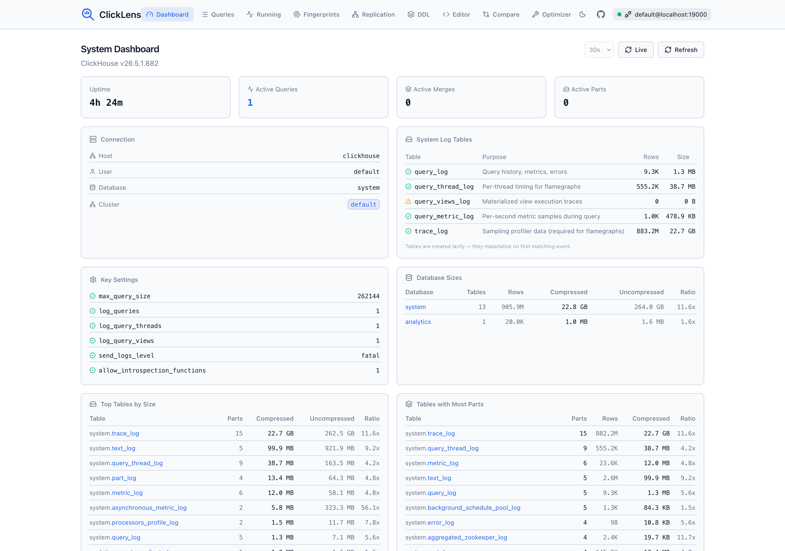
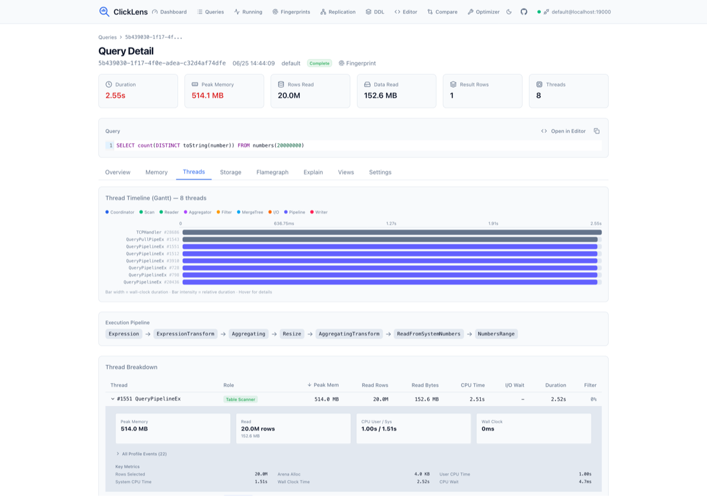
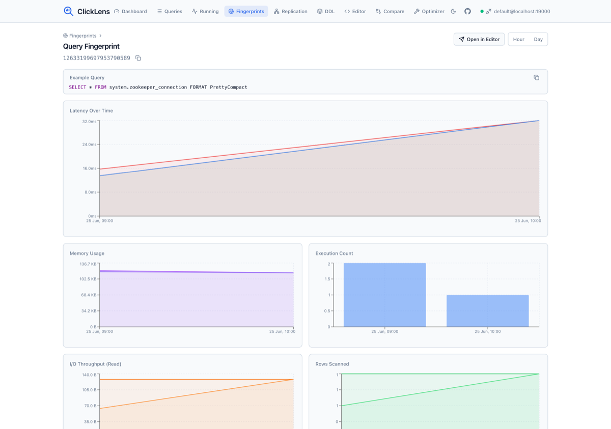
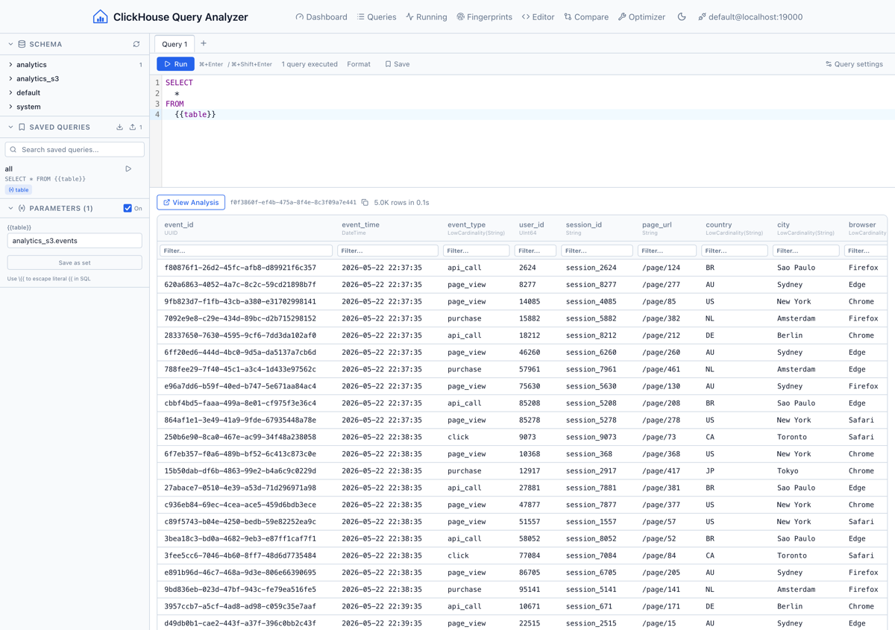
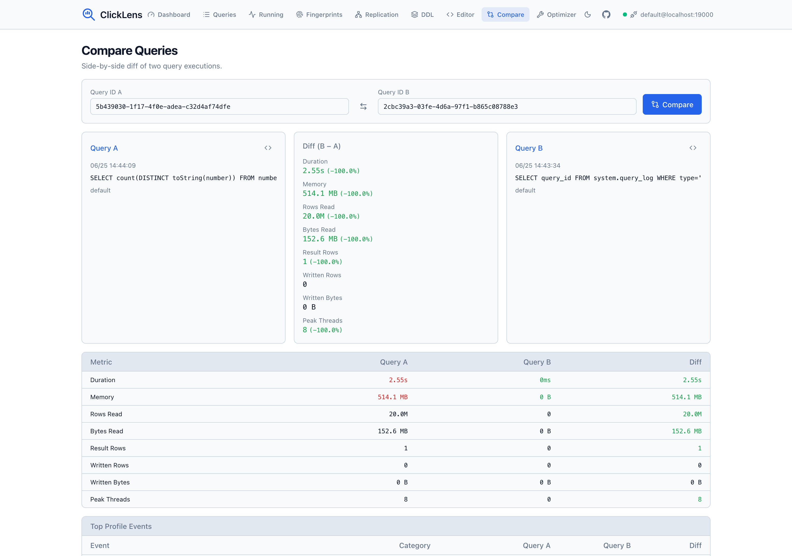

# ClickLens

A single-binary tool with a built-in web UI to analyze ClickHouse query executions. Connect to any ClickHouse instance, explore query logs, drill into CPU/memory/IO usage per thread, view flame graphs, compare queries side by side, and run ad-hoc SQL.

## Features

- **System Dashboard** — Overview of uptime, active queries/merges/parts, database sizes, top tables by size and part count, system metrics and events. Replica status and replication queue for clusters.
- **Query List** — Browse, filter, sort, and paginate through `system.query_log` including failed queries
- **Query Detail** — Overview with RAM/CPU/IO time-series charts, top ProfileEvents, thread breakdown with role inference, memory analysis, storage I/O stats, and settings
- **Flame Graphs** — Canvas-based flame graphs from `system.trace_log` (Memory/MemorySample/MemoryPeak/CPU/Real) with auto-detection of available trace types
- **Visual EXPLAIN** — Interactive collapsible tree view of the execution plan, plus raw pipeline and syntax views
- **Thread Breakdown** — Per-thread role inference (Coordinator, Scan+Filter, Aggregator, I/O Pool), pipeline visualization from EXPLAIN PIPELINE, top DB functions from trace data
- **Query Fingerprints** — Group queries by `normalized_query_hash`, view aggregated stats (count, avg/P50/P95 latency, memory, I/O), drill into per-fingerprint performance trends over time
- **Running Queries** — Live view of `system.processes` with auto-refresh, kill query support
- **SQL Editor** — CodeMirror 6 editor with schema browser sidebar, column type display, copy-on-hover cells, and "View Analysis" link to jump to profiling data
- **Saved Queries** — Save, load, search, import, and export queries. Saved queries are stored in browser localStorage and organized in an accordion sidebar panel.
- **Parameterized Queries** — Use `{{param_name}}` syntax in any query to define parameters. Parameter input fields appear automatically in the sidebar. Values are substituted at execution time. Escape with `\{{` for literal `{{`.
- **Query Comparison** — Side-by-side diff of two queries including ProfileEvents metrics
- **Cluster Support** — Auto-detects `system.clusters`, uses `clusterAllReplicas`
- **Table Optimizer** — Analyze single tables, entire databases, or all databases for ClickHouse optimization opportunities including LowCardinality, integer right-sizing, Nullable removal, ORDER BY/PARTITION BY suggestions, skipping indices, codec recommendations, and table health checks. Generates copy-ready ALTER TABLE DDL. Bulk analysis streams results in real-time via SSE.

## Screenshots

### System Dashboard


### Query Detail


### Query Fingerprints


### SQL Editor


### Query Comparison


### Table Optimizer


## Quick Start

### Docker

```bash
docker pull ghcr.io/nimbleflux/clickhouse-query-analyzer:latest
docker run -p 8080:8080 ghcr.io/nimbleflux/clickhouse-query-analyzer:latest
```

Open http://localhost:8080 and enter your ClickHouse connection details in the top bar.

### Binary

Download from [Releases](https://github.com/nimbleflux/clickhouse-query-analyzer/releases) for your platform:

```bash
# Linux/macOS
chmod +x clickhouse-query-analyzer-*
./clickhouse-query-analyzer-linux-amd64 -port 8080
```

### Build from Source

```bash
make build
./clickhouse-query-analyzer
```

## Connection

The tool connects to ClickHouse via the browser — no ClickHouse credentials are stored server-side. Supported URL schemes:

| Scheme | Protocol | TLS |
|--------|----------|-----|
| `clickhouse://host:9000` | Native TCP | No |
| `clickhouses://host:9440` | Native TCP | Yes |
| `http://host:8123` | HTTP API | No |
| `https://host:8443` | HTTP API | Yes |

For self-signed certificates, check "Skip TLS verify" in the connection bar.

### TLS Certificates for ClickHouse Connections

ClickLens connects to ClickHouse from the browser, so TLS certificates must be trusted by the **client browser** (or the system running the browser), not by the ClickLens server.

- **Trusted CA** — If ClickHouse uses a certificate from a public CA (e.g. Let's Encrypt), no extra steps are needed.
- **Internal / self-signed CA** — Install the CA certificate on each machine running the browser:
  - **macOS**: Add to Keychain → System keychain → set to "Always Trust"
  - **Linux**: Copy to `/usr/local/share/ca-certificates/` and run `sudo update-ca-certificates`
  - **Windows**: Import into "Trusted Root Certification Authorities" via certmgr.msc
- **Skip TLS verify** — For development or air-gapped environments, check "Skip TLS verify" in the connection bar. This disables certificate validation for that connection.
- **Docker** — When running ClickLens behind a reverse proxy (nginx, Caddy, Traefik) that terminates TLS, mount the certificate and key into the proxy container. Example for nginx:

  ```yaml
  services:
    clicklens:
      image: ghcr.io/nimbleflux/clickhouse-query-analyzer:latest
      ports:
        - "8080:8080"
    nginx:
      image: nginx:alpine
      ports:
        - "443:443"
      volumes:
        - ./nginx.conf:/etc/nginx/nginx.conf:ro
        - ./certs/tls.crt:/etc/nginx/tls.crt:ro
        - ./certs/tls.key:/etc/nginx/tls.key:ro
  ```

## Dev Environment

```bash
# Start ClickHouse with sample data
make dev-clickhouse
make seed

# Run with hot-reload frontend
make dev
```

The dev ClickHouse runs on ports 18123 (HTTP) and 19000 (native) to avoid conflicts with existing instances. Connect using `clickhouse://localhost:19000` or `http://localhost:18123`.

## Setup & Diagnostics

ClickLens requires certain ClickHouse settings and log tables to be enabled for full functionality. The **Dashboard** page surfaces live diagnostics — connection info, log table status, key settings, and actionable warnings.

### Required Settings

Add these to your ClickHouse server config (`config.xml` or `users.xml`):

```xml
<!-- Enable query logging -->
<log_queries>1</log_queries>

<!-- Enable thread-level profiling -->
<log_query_threads>1</log_query_threads>

<!-- Enable materialized view logging (optional) -->
<log_query_views>1</log_query_views>

<!-- Enable detailed metric logging (optional) -->
<log_query_metrics>1</log_query_metrics>

<!-- Required for flamegraphs -->
<allow_introspection_functions>1</allow_introspection_functions>

<!-- Enable sampling profiler (for flamegraphs) -->
<log_profiler_events>1</log_profiler_events>
```

### Log Table Sizing

ClickLens queries these `system.*` log tables:

| Table | Purpose | Recommended Retention |
|-------|---------|----------------------|
| `system.query_log` | Query history, metrics, errors | 7-30 days |
| `system.query_thread_log` | Per-thread timing for flamegraphs | 7-30 days |
| `system.query_views_log` | Materialized view execution | 7-30 days |
| `system.query_metric_log` | Per-second metrics during query | 1-7 days |
| `system.trace_log` | Sampling profiler data | 1-7 days |

For large deployments, configure TTL to manage disk usage:

```sql
ALTER TABLE system.query_log MODIFY TTL event_time + INTERVAL 14 DAY;
ALTER TABLE system.query_thread_log MODIFY TTL event_time + INTERVAL 14 DAY;
ALTER TABLE system.trace_log MODIFY TTL event_time + INTERVAL 7 DAY;
```

The **Dashboard** page shows current row counts and on-disk sizes for these tables, plus warnings for empty or missing tables. Each missing table has an inline "enable" toggle that reveals the exact XML snippet to add to your `config.xml`.

## Architecture

- **Backend**: Go with Chi router, `clickhouse-go/v2` driver (native + HTTP), stateless connection pool
- **Frontend**: React + TypeScript + Vite + Tailwind CSS + Recharts + CodeMirror 6
- **Single binary**: Frontend embedded via `//go:embed`, served as static files
- **Stateless**: Connection params sent via `X-CH-*` headers per request, backend pools connections keyed by URL+user+db

## Security

ClickLens is a developer tool, not a multi-tenant application. The backend has **no built-in authentication**. You must understand the following before deploying:

### Must do

- **Put ClickLens behind an authenticating reverse proxy** (nginx, Caddy, OAuth2 Proxy, Cloudflare Access, etc.). The app itself does not authenticate users. Without a proxy, anyone who can reach the port can run arbitrary SQL against your ClickHouse.
- **Use TLS**. ClickHouse passwords are sent as HTTP headers on every request. Without TLS (HTTPS), they traverse the network in cleartext. Use a reverse proxy or load balancer that terminates TLS.
- **Bind to `127.0.0.1`** if running locally (`-port 8080` binds to `0.0.0.0` by default; use a reverse proxy to restrict access).

### Security model and limitations

- **No authentication**: There is no auth middleware. Every API endpoint is open. The operator-configured `CLICKHOUSE_URL` / `CLICKHOUSE_PASSWORD` env vars are used as fallback for any unauthenticated request that omits `X-CH-URL`, meaning an exposed instance gives attackers full SQL access to your ClickHouse.
- **Read-only mode is advisory, not a security boundary**: The "Read only" toggle in the connection bar sends an `X-CH-Readonly: 1` header. This is a UX convenience that blocks obvious write statements (INSERT, DROP, ALTER, etc.). It is **trivially bypassable** by omitting the header or using statement forms the prefix-check doesn't catch (comments, CTEs, SET). For real read-only enforcement, create a read-only ClickHouse user and connect with those credentials.
- **CORS defaults to same-origin**: By default, no CORS headers are emitted, so the API is only accessible from the same origin. Use `-cors-origin` or `CORS_ORIGIN` to allow a specific trusted origin. Using `*` allows cross-origin requests but does **not** advertise the `X-CH-*` credential headers, preventing cross-origin CSRF.
- **Password stored in browser localStorage**: The connection form persists credentials (including password) in `localStorage` for convenience. This is readable by browser extensions and any XSS on the origin. Clear localStorage after use on shared machines.
- **SSRF**: The app connects to whatever ClickHouse URL the user provides. An attacker can point it at internal hosts (metadata endpoints, other databases). Restrict network access at the infrastructure level.
- **Security headers**: The app sets `X-Content-Type-Options: nosniff`, `X-Frame-Options: DENY`, and `Referrer-Policy: no-referrer`. Add a `Content-Security-Policy` via your reverse proxy for full coverage.

### Built-in protections

- Request body size limited to 1 MB
- SQL query result rows capped (server-side pagination, `max_result_rows` enforced after user settings)
- Trace log queries capped at 10,000 rows
- Prometheus metrics use route patterns (not raw URLs) to prevent cardinality explosion
- ClickHouse passwords are never logged (SHA-256 hash used only as an internal pool key)
- The `/api/config` endpoint does not expose the password (only a `has_password` boolean)

## License

MIT
