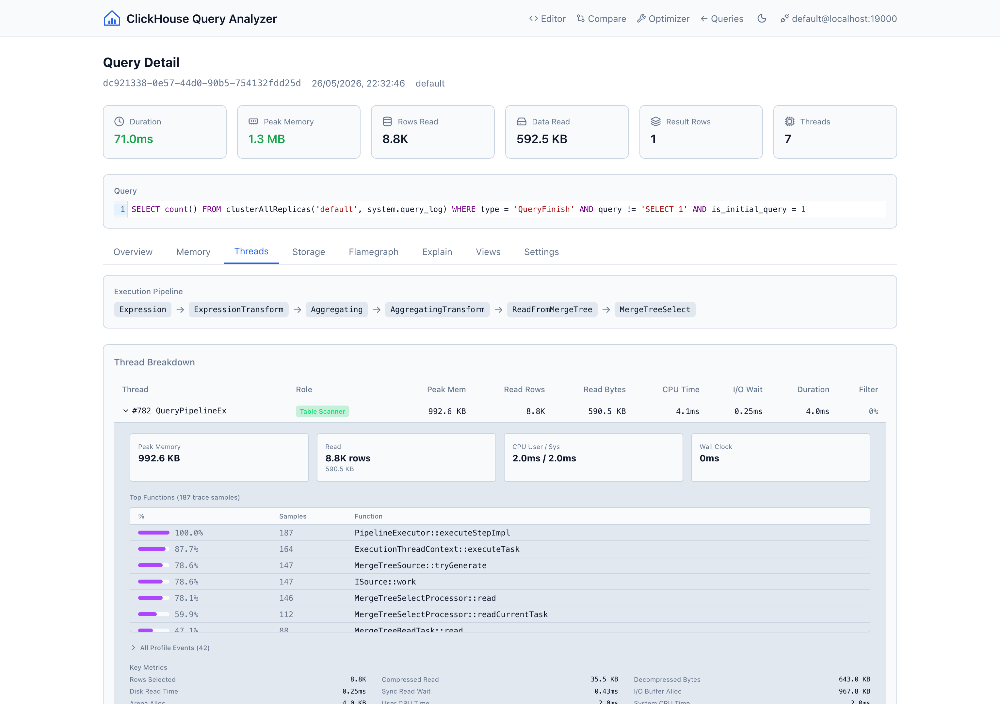
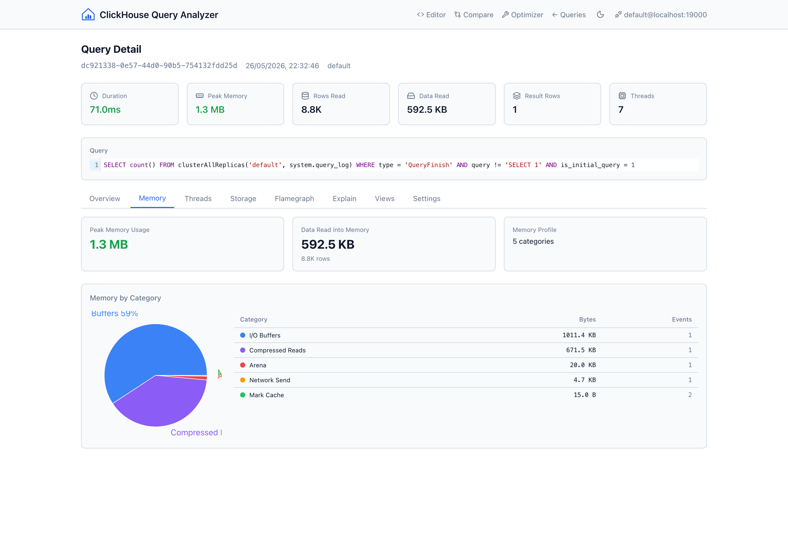
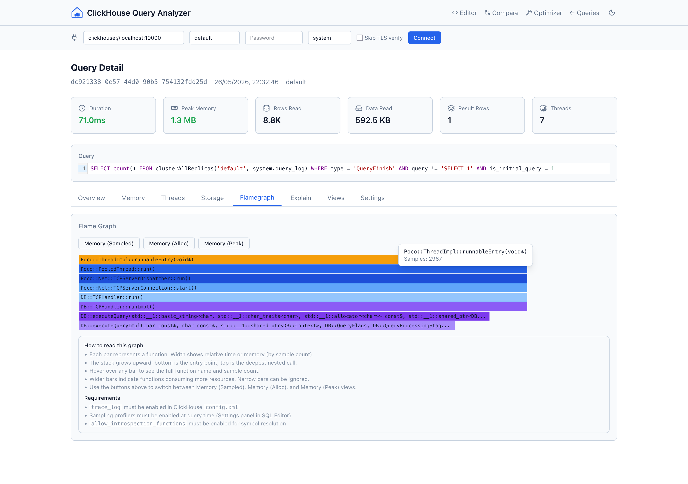
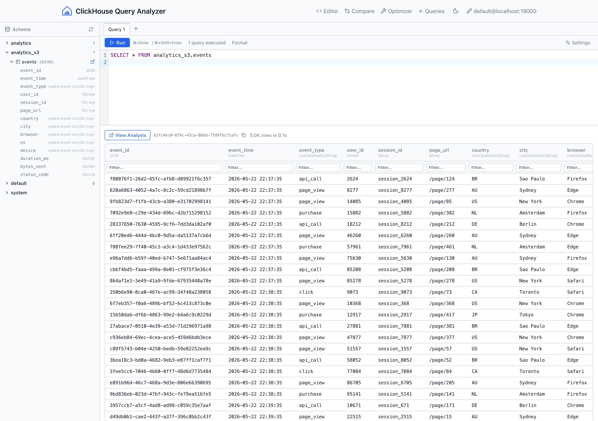
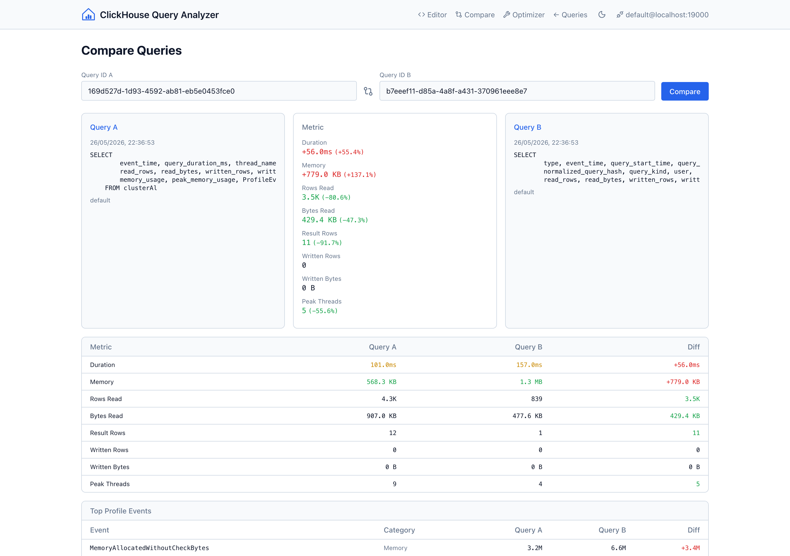
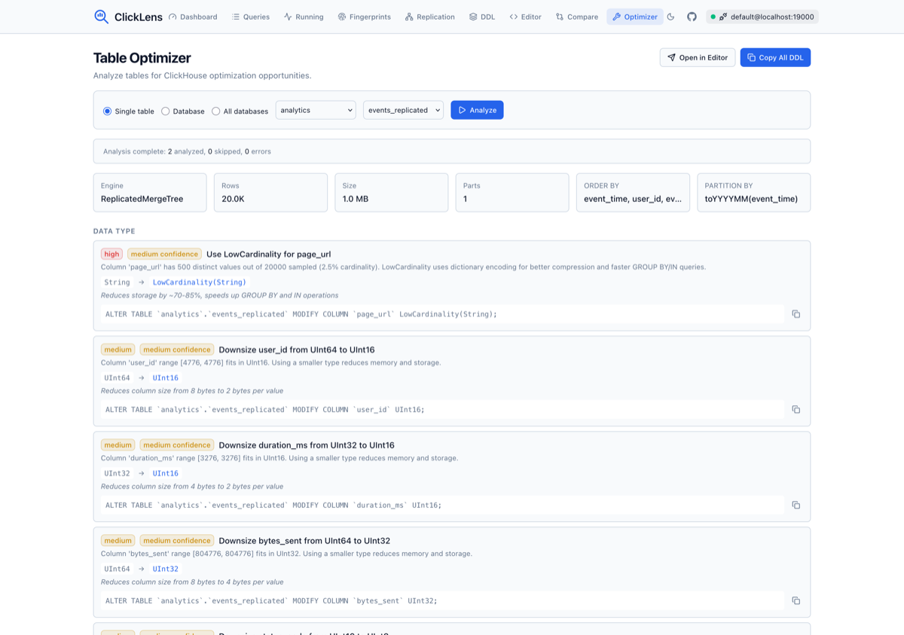

# ClickHouse Query Analyzer

A single-binary tool with a built-in web UI to analyze ClickHouse query executions. Connect to any ClickHouse instance, explore query logs, drill into CPU/memory/IO usage per thread, view flame graphs, compare queries side by side, and run ad-hoc SQL.

## Features

- **Query List** — Browse, filter, sort, and paginate through `system.query_log`
- **Query Detail** — Overview with RAM/CPU/IO time-series charts, top ProfileEvents, thread breakdown with role inference, memory analysis, storage I/O stats, and settings
- **Flame Graphs** — Canvas-based flame graphs from `system.trace_log` (Memory/MemorySample/MemoryPeak)
- **Thread Breakdown** — Per-thread role inference (Coordinator, Scan+Filter, Aggregator, I/O Pool), pipeline visualization from EXPLAIN PIPELINE, top DB functions from trace data
- **SQL Editor** — CodeMirror 6 editor with schema browser sidebar, column type display, copy-on-hover cells, and "View Analysis" link to jump to profiling data
- **Saved Queries** — Save, load, search, import, and export queries. Saved queries are stored in browser localStorage and organized in an accordion sidebar panel.
- **Parameterized Queries** — Use `{{param_name}}` syntax in any query to define parameters. Parameter input fields appear automatically in the sidebar. Values are substituted at execution time. Escape with `\{{` for literal `{{`.
- **Query Comparison** — Side-by-side diff of two queries including ProfileEvents metrics
- **EXPLAIN** — Execution plan, pipeline, and syntax views
- **Cluster Support** — Auto-detects `system.clusters`, uses `clusterAllReplicas`
- **Table Optimizer** — Analyze single tables, entire databases, or all databases for ClickHouse optimization opportunities including LowCardinality, integer right-sizing, Nullable removal, ORDER BY/PARTITION BY suggestions, skipping indices, codec recommendations, and table health checks. Generates copy-ready ALTER TABLE DDL. Bulk analysis streams results in real-time via SSE.

## Screenshots

### Query Analyzer


### Memory Overview


### Flame Graph


### SQL Editor


### Query Comparison


### Table Optimizer


## Quick Start

### Docker

```bash
docker pull ghcr.io/nimbleflux/clickhouse-query-analyzer:latest
docker run -p 8080:8080 ghcr.io/nimbleflux/clickhouse-query-analyzer:latest
```

Open http://localhost:8080 and enter your ClickHouse connection details in the top bar.

### Binary

Download from [Releases](https://github.com/nimbleflux/clickhouse-query-analyzer/releases) for your platform:

```bash
# Linux/macOS
chmod +x clickhouse-query-analyzer-*
./clickhouse-query-analyzer-linux-amd64 -port 8080
```

### Build from Source

```bash
make build
./clickhouse-query-analyzer
```

## Connection

The tool connects to ClickHouse via the browser — no ClickHouse credentials are stored server-side. Supported URL schemes:

| Scheme | Protocol | TLS |
|--------|----------|-----|
| `clickhouse://host:9000` | Native TCP | No |
| `clickhouses://host:9440` | Native TCP | Yes |
| `http://host:8123` | HTTP API | No |
| `https://host:8443` | HTTP API | Yes |

For self-signed certificates, check "Skip TLS verify" in the connection bar.

## Dev Environment

```bash
# Start ClickHouse with sample data
make dev-clickhouse
make seed

# Run with hot-reload frontend
make dev
```

The dev ClickHouse runs on ports 18123 (HTTP) and 19000 (native) to avoid conflicts with existing instances. Connect using `clickhouse://localhost:19000` or `http://localhost:18123`.

## Architecture

- **Backend**: Go with Chi router, `clickhouse-go/v2` driver (native + HTTP), stateless connection pool
- **Frontend**: React + TypeScript + Vite + Tailwind CSS + Recharts + CodeMirror 6
- **Single binary**: Frontend embedded via `//go:embed`, served as static files
- **Stateless**: Connection params sent via `X-CH-*` headers per request, backend pools connections keyed by URL+user+db

## License

MIT
